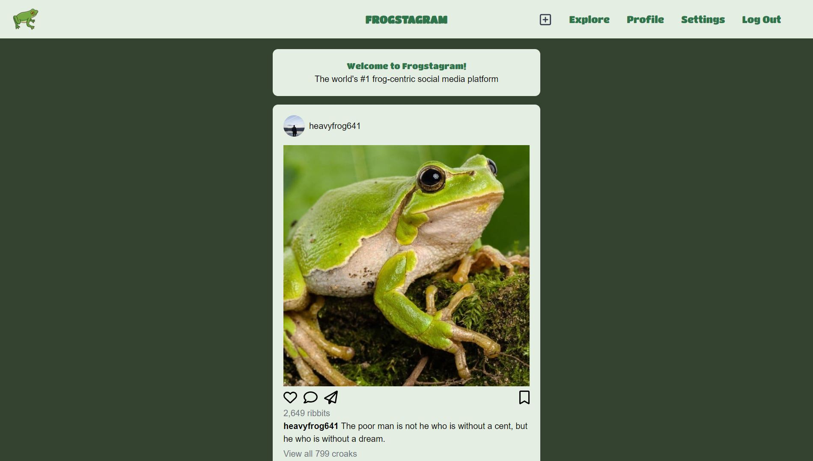
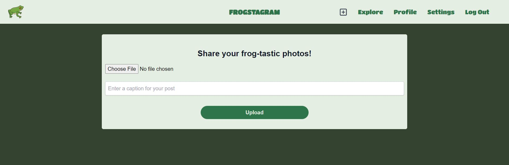
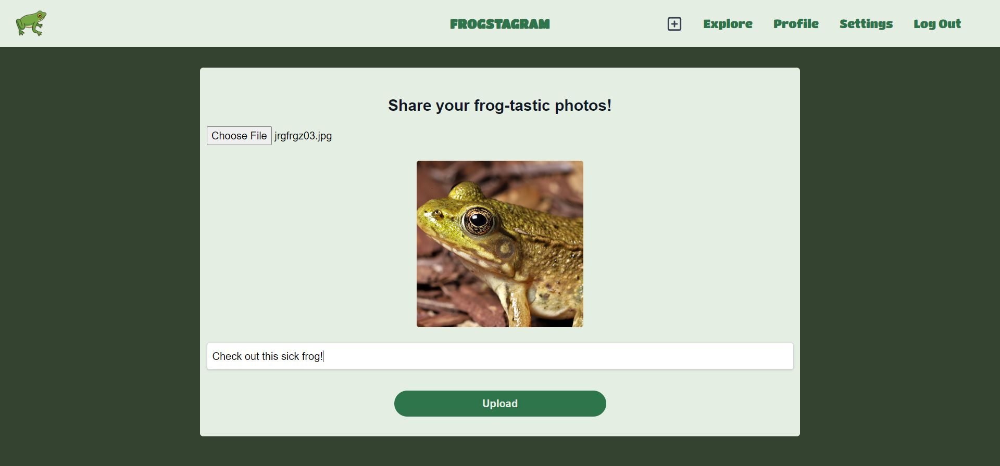
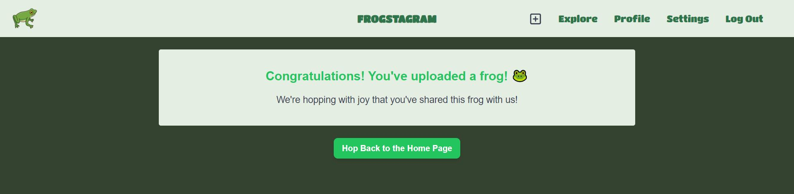
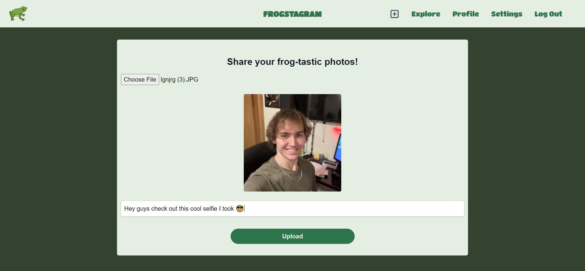
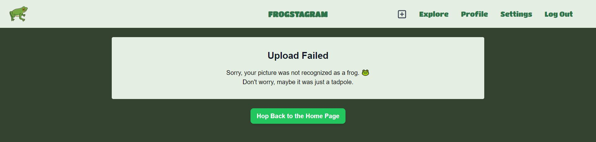

# **frogstagram**

## **The the world's most advanced frog photo sharing app**

 

### **What is frogstagram?**

Frogstagram is a photo sharing app that allows users to upload photos of frogs and view photos of frogs uploaded by other users. Users can also comment on photos and like photos.

Only users who are logged in can upload photos and comment on photos. Users can also delete their own photos and comments.

The catch with frogstagram is that it only allows photos of frogs to be uploaded. If a user tries to upload a photo that is not of a frog, they will be notified that their photo is not a frog and will not be able to upload it. Determining whether a photo is a frog or not a frog is done by a machine learning algorithm that is trained on a dataset of photos.
 
 
 

<!-- Access image from /docs-and-readme/img/Frogstagram1.JPG -->

<figure>
  
  <figcaption>Frogstagram homepage</figcaption>
</figure>
 

# Creating a post

To create a post, click the upload button in the navigation bar. This will take you to the upload page. Here you can upload a photo of a frog and add a caption to the photo. Once you have uploaded the photo and added a caption, click the "Upload" button to upload the photo to the database.

<figure>
  
  <figcaption>Upload page</figcaption>
</figure>
 
 

# If your photo is a frog...

If your photo is recognized as a frog, you will be redirected to the success page, and your photo will be uploaded to the database. After, you can view your photo on the homepage, and other users will be able to view your photo.

<figure>
    
    <figcaption>Upload page with a frog photo selected</figcaption>
</figure>
 

<figure>
  
  <figcaption>Success page after uploading the frog photo</figcaption>
</figure>
 
 
 

# If your photo is not a frog...

If your photo is not recognized as a frog, you will be redirected to the failure page, and your photo will not be uploaded to the database.
 

<figure>
    
    <figcaption>Upload page with a non-frog (me) photo selected</figcaption>
</figure>

<figure>
  
  <figcaption>Failure page</figcaption>
</figure>
